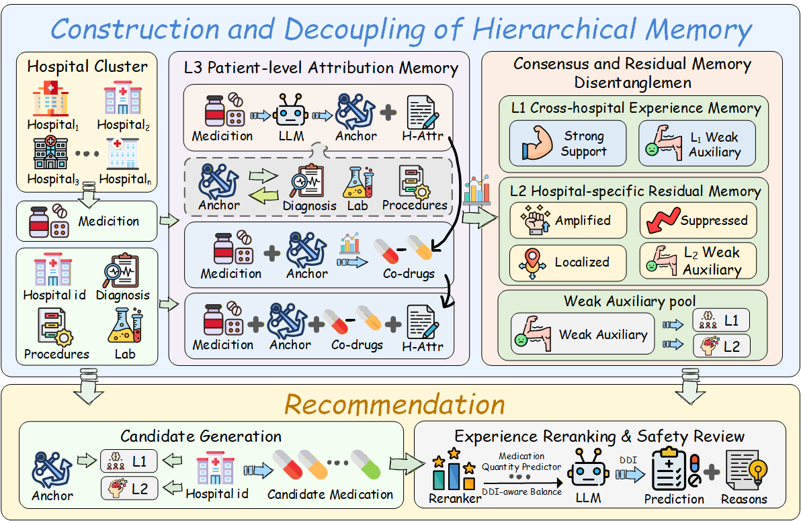
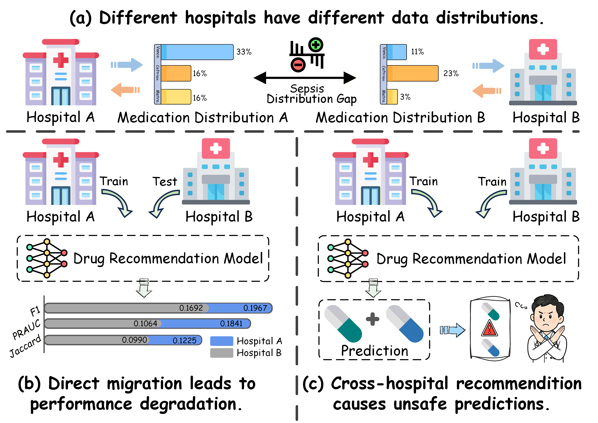

    

HEM-Med

This repository provides the anonymous implementation of “HEM-Med: A Hierarchical Agentic Memory Framework for Safe Multi-Center Medication Recommendation”. HEM-Med is designed for safe multi-center ICU medication recommendation by disentangling cross-hospital consensus experience from hospital-specific residual prescribing patterns and generating medication sets through memory retrieval, calibrated reranking, and DDI-aware decoding.

This anonymous release contains three complementary code views:

paper_experiments/: the original core experiment scripts that support the paper results, including the final Improved Balanced full-split run and its v11-v13.3 dependency chain.
l3_construction/: the L3 patient-context attribution construction code based on DeepSeek/OpenAI-compatible API calls.
src/: a cleaner, modular reference implementation for reading the method, checking schemas, and running lightweight smoke tests.

Raw EHR data, generated L3/L1/L2 memories, trained outputs, predictions, API responses, token-usage logs, checkpoints, and private API keys are intentionally excluded from this anonymous release.

  

Figure 1: Overview of HEM-Med. The framework constructs patient-level attribution memory, aggregates it into cross-hospital consensus memory and hospital-specific residual memory, and generates the final medication set through calibrated prediction and DDI-aware decoding.

✨ Overview

  

HEM-Med addresses two key challenges in multi-center medication recommendation:

Gap 1: Entangled Cross-Hospital Knowledge

Existing methods for multi-center medication recommendation often overlook a subtle but critical clinical reality: prescribing decisions are influenced not only by generalizable medical knowledge, but also by hospital resources, institution-specific treatment pathways, local medication protocols, departmental expertise, and physician prescribing preferences.
As illustrated in the motivation figure, different hospitals may exhibit distinct medication distributions even for the same disease condition. In complex ICU scenarios with multiple coexisting conditions, directly transferring such entangled knowledge across hospitals may lead to negative transfer. In other words, knowledge acquired from one hospital may not always be clinically effective or locally feasible when directly applied to another hospital.

Gap 2: Insufficient Safety Awareness
Existing transfer-based recommendation methods mainly focus on representation alignment, while paying insufficient attention to the safety constraints inherent in clinical medication recommendation. Unlike general cross-domain recommendation, medication recommendation is a clinically constrained multi-label prediction problem that must jointly consider treatment requirements, medication safety, potential drug-drug interactions, and local formulary feasibility.
If multi-hospital recommendation only accounts for distributional discrepancies without explicitly modeling DDI risks and local feasibility, it may generate clinically inappropriate or unsafe medication combinations, posing significant risks to real-world clinical deployment.

To address these challenges, HEM-Med explicitly disentangles cross-hospital consensus experience from hospital-specific residual prescribing patterns and integrates DDI-aware decoding for safer medication set generation.

HEM-Med introduces a hierarchical agentic memory framework with three levels:

L3 patient-level attribution memory: patient-context attribution records constructed from stay-medication observations.
L1 consensus memory: cross-hospital statistical experience shared across centers.
L2 residual memory: hospital-specific amplified, suppressed, or localized prescribing patterns.

During online recommendation, the original L3 records are not directly retrieved. Instead, L3 is used offline to construct L1 consensus memory, L2 hospital residual memory, and attenuated weak auxiliary evidence.

📁 Repository Layout
anonymous-HEM-Med/
├── README.md
├── requirements.txt
├── .gitignore
├── configs/
│   └── default.yaml
├── l3_construction/                         # L3 patient-context attribution construction
│   ├── README.md
│   ├── configs/
│   │   └── private/
│   │       └── deepseek_key_template.py
│   └── scripts/
│       ├── deepseek_l3_case_level_generation/
│       ├── deepseek_l3_min_token_single_anchor_run/
│       └── deepseek_l3_test20_dx_px_nonempty_min_token_prompt_audit/
├── paper_experiments/                       # exact paper experiment lineage
│   ├── README.md
│   ├── final_balanced_main/                 # final Improved Balanced full split run
│   ├── v13_3_weak_pairwise_hierarchical_small/
│   └── memory_and_reranking/                # v11-v13.3 dependency chain
├── src/                                     # clean reference implementation
│   ├── build_l1_memory.py
│   ├── build_l2_memory.py
│   ├── candidate_generation.py
│   ├── train_reranker.py
│   ├── ddi_decoding.py
│   ├── evaluate.py
│   └── utils.py
├── scripts/                                 # lightweight reference scripts
│   ├── run_memory.sh
│   ├── run_train.sh
│   └── run_eval.sh
├── data/
│   └── README.md
└── docs/
    ├── DATA_AND_ARTIFACTS.md
    ├── EXPERIMENT_SUMMARY.md
    ├── L3_DEEPSEEK_CONSTRUCTION_METHOD_SECTION.md
    └── ORIGINAL_HEM_MED_README.md
🧪 Which Code Supports the Paper Results?

Use paper_experiments/ for paper-result reproduction.

The final paper method is implemented by:

paper_experiments/final_balanced_main/run_full_experiment.py
paper_experiments/v13_3_weak_pairwise_hierarchical_small/run_experiment.py
paper_experiments/memory_and_reranking/**

The full paper result reported in the experiment summary is the Improved Balanced run on the official 72,436 / 9,054 / 9,055 train / validation / test split.

The l3_construction/ directory provides the code used to construct patient-level L3 attribution records. Generated L3 files are not included in this anonymous release, but the construction scripts are retained for transparency.

The src/ directory is intentionally simpler. It mirrors the main ideas in readable modules but is not the exact code used to produce the final paper metrics.

📊 Main Reported Result

The final paper method is Improved Balanced, which combines:

decoupled L1/L2 memory retrieval;
attenuated weak-memory auxiliary evidence;
pointwise and pairwise logistic reranking;
two-stage class-drug scoring;
per-drug Platt calibration;
medication-count prediction;
DDI-aware beam-search decoding.

The full official split result is summarized in docs/EXPERIMENT_SUMMARY.md:

Metric	Value
Precision	0.4511
Recall	0.4614
F1	0.4533
Jaccard	0.3246
Drug-level micro PR-AUC	0.4161
Case-level mean PR-AUC	0.5301
DDI Rate	8.31%
SAJ	0.2976
SafeScore 0.3649

For more detailed experimental results, please see docs/EXPERIMENT_SUMMARY.md.

🧠 Method Pipeline

The main pipeline consists of the following stages:

Construct patient-level L3 attribution records from stay-medication observations.
Aggregate L3 records into L1 cross-hospital consensus memory and L2 hospital-specific residual memory.
Retrieve candidate medications from L1/L2 memory, weak auxiliary evidence, priors, and DDI-aware features.
Train pointwise and pairwise reranking models.
Apply two-stage class-drug scoring and per-drug Platt calibration.
Predict medication count and decode the final medication set with DDI-aware beam search.
🛠️ Environment

Python 3.10+ is recommended.

Create an environment and install optional API dependencies:

python3 -m venv .venv
source .venv/bin/activate
pip install -r requirements.txt

requirements.txt intentionally contains only:

openai>=1.0.0
httpx>=0.24.0

These packages are needed only for L3 DeepSeek/OpenAI-compatible API construction. The pure-Python reranking path does not require PyTorch, scikit-learn, NumPy, or pandas.

📦 Data and Artifacts

This repository does not redistribute raw EHR data or private generated memory artifacts. To run the paper code, prepare artifacts locally and either place them under data/ or point HEM_MED_DATA_DIR to an external artifact directory.

Expected local layout:

data/
  splits/split_8_1_1_nonempty_med_seed1203/
    train_80pct.jsonl
    validation_10pct.jsonl
    test_10pct.jsonl
  memory/
    L1_statistical_memory_final_cleaned.json
    L1_statistical_memory_final_cleaned_with_weak_candidates.json
    L2_final_merged_memory.json
  ddi/
    eicu_space_ddi_pairs_simple.csv

The historical v11-v13 dependency chain also expects private experiment inputs under:

paper_experiments/memory_and_reranking/have_anchor_L1L2_full_reranker_ddi_ablation_v11/inputs/
  L1_statistical_memory_from_have_anchor.json
  L2_hospital_residual_memory_from_have_anchor.json
  eicu_space_ddi_pairs_simple.csv
  eicu_space_ddi_pair_set.csv
  medication_vocabulary.json
  medication_vocabulary_canonical.json
  global_medication_prior.json
  hospital_medication_prior.json
  anchor_medication_prior.json
  hospital_anchor_medication_prior.json
  test_100_have_anchor.jsonl

For the full artifact table, schemas, expected paths, and generation notes, please see docs/DATA_AND_ARTIFACTS.md.

🧬 L3 Construction

The l3_construction/ directory contains the code used to construct the patient-level L3 attribution records described in the paper. It is included for transparency and reproducibility of the L3 construction process.

Generated L3 JSONL files, raw API responses, token-usage logs, checkpoints, and reports are not included in the anonymous release.

L3 Pipeline
Build compact stay-level inputs for the LLM:
cd l3_construction
bash scripts/deepseek_l3_case_level_generation/run_14_build_minimal_case_input_for_llm.sh

This expects the private preprocessed stay file at:

outputs/stage1_preprocess_final/stay_level_all_detailed.jsonl

and writes compact L3 inputs under:

outputs/deepseek_l3_minimal_case_inputs/
Run DeepSeek/OpenAI-compatible single-anchor L3 generation:
cd l3_construction
cp configs/private/deepseek_key_template.py configs/private/deepseek_key.py
# Fill configs/private/deepseek_key.py locally, or configure your environment.
bash scripts/deepseek_l3_min_token_single_anchor_run/run_01_deepseek_l3_min_token_single_anchor.sh

The main generated L3 file has the form:

outputs/deepseek_l3_min_token_single_anchor_run/L3_deepseek_generated_<tag>.jsonl
Postprocess generated L3 records:
cd l3_construction
bash scripts/deepseek_l3_min_token_single_anchor_run/run_02_postprocess_l3_reasonable_anchor_limit20_promptv2_cleaninput.sh
Recover L3 records from saved raw responses when needed:
cd l3_construction
bash scripts/deepseek_l3_min_token_single_anchor_run/run_03_recover_l3_from_raw_responses_limit100_promptv2_cleaninput.sh
Optional prompt audit without API calls:
cd l3_construction
bash scripts/deepseek_l3_test20_dx_px_nonempty_min_token_prompt_audit/run_01_build_min_token_prompts_test20.sh
Included L3 Code
scripts/deepseek_l3_case_level_generation/
  14_build_minimal_case_input_for_llm.py
  run_14_build_minimal_case_input_for_llm.sh

scripts/deepseek_l3_min_token_single_anchor_run/
  01_run_deepseek_l3_min_token_single_anchor.py
  02_postprocess_l3_reasonable_anchor.py
  03_recover_l3_from_raw_responses.py
  check_deepseek_key.py
  run_01_deepseek_l3_min_token_single_anchor.sh
  run_02_postprocess_l3_reasonable_anchor_limit20_promptv2_cleaninput.sh
  run_03_recover_l3_from_raw_responses_limit100_promptv2_cleaninput.sh
  run_full_offset20000_auto_resume.sh

scripts/deepseek_l3_test20_dx_px_nonempty_min_token_prompt_audit/
  01_build_min_token_prompts_test20.py
  run_01_build_min_token_prompts_test20.sh

configs/private/deepseek_key_template.py

Files under l3_construction/outputs/ are not included, including:

L3_deepseek_generated_*.jsonl
raw_responses_*.jsonl
token_usage_*.csv
checkpoint_*.sqlite
run_report_*.json
failed_records_*.jsonl
schema_error_records_*.jsonl

These files may contain private EHR-derived intermediate information, API responses, or run metadata.

🚀 Reproduce the Final Paper Experiment

After preparing the required artifacts, run:

export HEM_MED_DATA_DIR=/path/to/hem_med_data
bash paper_experiments/final_balanced_main/run_full.sh

The run writes generated outputs under:

paper_experiments/final_balanced_main/outputs_full_split/

Important generated files include:

full_split_report.json
predictions_balanced.jsonl
case_level_average_precision.jsonl
pointwise_weights.json
pairwise_weights.json
class_model_weights.json
count_classifier_weights.json
per_drug_platt_parameters.json
medication_class_map.json

These files are not included in the anonymous release because they are generated artifacts.

🧩 Lightweight Reference Pipeline

The scripts under scripts/ run the simplified modular implementation in src/. They are useful for schema checks and small local smoke tests, not for reproducing the final paper numbers.

Build compact L1/L2 memories from a local train split:

bash scripts/run_memory.sh

Generate candidates and train the lightweight reference reranker:

bash scripts/run_train.sh

Run reference candidate generation, DDI-aware decoding, and evaluation:

bash scripts/run_eval.sh

If artifacts are outside the repository:

export HEM_MED_DATA_DIR=/path/to/hem_med_data
bash scripts/run_train.sh
📝 L3 Construction Notes

The L3 construction method uses DeepSeek/OpenAI-compatible API calls to select constrained patient-context anchors. The method text and prompt/cleaning logic are documented in:

docs/L3_DEEPSEEK_CONSTRUCTION_METHOD_SECTION.md

Private API keys are not included. If running L3 construction locally, set DEEPSEEK_API_KEY in the environment or use a private local key file that is not committed.

🔒 Anonymous Release Policy

The following are intentionally not included:

raw EHR data;
generated L3/L1/L2 memory files;
trained weights and generated reports;
prediction files;
API raw responses and token-usage logs;
private API keys;
PDF manuscripts or identifying metadata

The .gitignore is configured to exclude these categories.

🧭 Troubleshooting
If run_full.sh fails with a missing split file, check HEM_MED_DATA_DIR and the data/splits/split_8_1_1_nonempty_med_seed1203/ layout.
If it fails with a missing memory or prior JSON, check docs/DATA_AND_ARTIFACTS.md and populate the historical v11 input directory.
If L3 construction fails with an API-key error, check configs/private/deepseek_key.py or the DEEPSEEK_API_KEY environment variable.
If L3 construction fails with a missing stay-level file, check whether outputs/stage1_preprocess_final/stay_level_all_detailed.jsonl exists locally.
If only a code smoke test is needed, use the lightweight scripts/ pipeline with a tiny synthetic sample_data/ directory.
If using git, confirm git status --short before upload and make sure no generated outputs/, data, cache, or key files are staged.
📖 Citation

This is an anonymous review release. Citation metadata can be added after de-anonymization.

🌟 Contributions and Suggestions

Contributions and suggestions are welcome after the anonymous review period.
